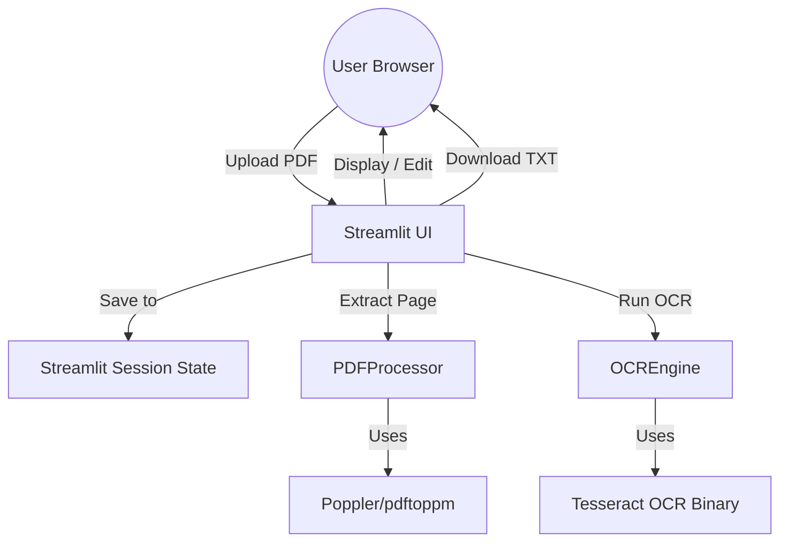

# Technical Specification: OCR PDF-to-Text Web Service

## 1. System Architecture



## 2. API Specification (Internal/Logical)

While Streamlit is a unified frontend-backend framework, the following logical API defines the data boundaries for the `PDFProcessor` and `OCREngine` services.

```yaml
openapi: 3.1.0
info:
  title: OCR PDF-to-Text Service
  version: 1.0.0
paths:
  /session/upload:
    post:
      summary: Upload and validate PDF
      responses:
        '200':
          description: PDF validated and metadata stored in session.
  /session/page/{page_number}:
    get:
      summary: Retrieve rendered image for a specific page
      parameters:
        - name: page_number
          in: path
          required: true
          schema:
            type: integer
      responses:
        '200':
          content:
            image/png:
              schema:
                type: string
                format: binary
  /session/ocr:
    post:
      summary: Trigger OCR on current page or document
      requestBody:
        content:
          application/json:
            schema:
              properties:
                language:
                  type: string
                  default: eng
                page:
                  type: integer
                  description: Optional page index for single-page OCR
      responses:
        '200':
          description: Extracted text returned and cached in session.
```

## 3. Session State Schema (In-Memory Database)

As per requirements, no persistent disk storage is used. All data resides in the user's `st.session_state`.

| Key | Type | Description |
| :--- | :--- | :--- |
| `pdf_content` | `bytes` | Binary content of the uploaded PDF file. |
| `page_count` | `int` | Total number of pages in the PDF. |
| `current_page` | `int` | Index of the page currently being viewed. |
| `ocr_results` | `dict[int, str]` | Mapping of page indices to extracted text. |
| `ocr_language` | `str` | Selected language code (e.g., 'eng', 'spa'). |
| `is_processing` | `bool` | Flag to manage UI loading states. |

## 4. Implementation Milestones

### Milestone 1: Streamlit Scaffolding & Validation
*   Setup `app.py` with Streamlit.
*   Implement `st.file_uploader` with file size (<20MB) and page count (<50) validation.
*   Integrate existing `PDFProcessor` to verify file integrity on upload.

### Milestone 2: Interactive Side-by-Side Viewer
*   Implement split layout using `st.columns([1, 1])`.
*   Render current PDF page as a PNG image in the left column.
*   Provide a text area in the right column for manual review/editing of results.
*   Add navigation controls (Previous/Next Page).

### Milestone 3: OCR Engine & Language Integration
*   Expose language selection dropdown (mapped to Tesseract codes).
*   Add "Run OCR" button that triggers `OCREngine.process_page()`.
*   Implement batch processing for "All Pages" with a progress bar.
*   Add "Extract Existing Text Layer" option for instant text extraction from searchable PDFs.

### Milestone 4: Persistence & State Management
*   Sync all UI inputs (text areas, navigation) with `st.session_state`.
*   Ensure refreshes reload data from the current session object.
*   Add "Download .txt" button using `st.download_button`.

### Milestone 5: Dockerization, Performance & System Checks
*   Add a system startup check (`shutil.which("tesseract")`) with helpful error messaging.
*   Update `Dockerfile` to include Tesseract-OCR and language packs.
*   Optimize image rendering performance (DPI tuning).
*   Add error handling for OCR failures and invalid PDF structures.
